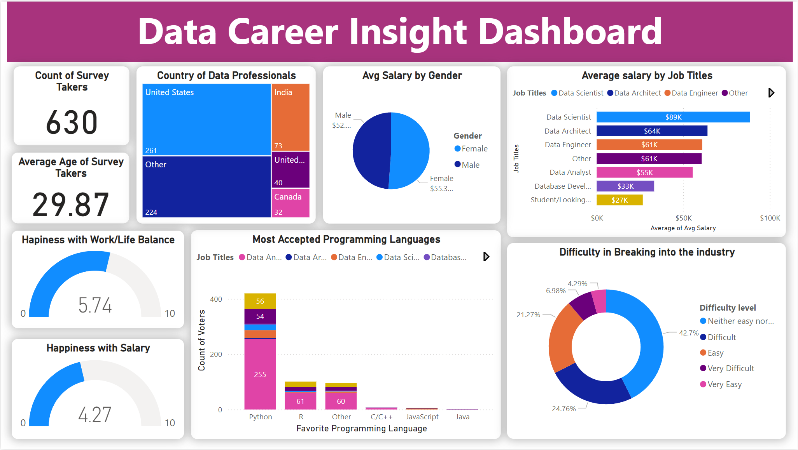

# Data Career Insights Dashboard: Global Survey Analysis 2024

## 📊 Project Overview

This interactive Power BI dashboard presents a comprehensive analysis of the global data profession landscape, based on a survey of 630 data professionals. The project provides valuable insights into salary trends, career progression, work satisfaction, and technical preferences across different data-related roles worldwide.

## 🎯 Key Features

- Demographic analysis of data professionals
- Salary comparisons across roles and genders
- Work satisfaction metrics
- Programming language preferences
- Geographic distribution of data professionals
- Industry entry difficulty assessment

## 📈 Key Findings

### Demographics & Distribution

- Total Survey Participants: 630
- Average Age: 29.87 years
- Geographic Distribution:
  - United States: 261 professionals
  - India: 73 professionals
  - United Kingdom: 40 professionals
  - Canada: 32 professionals
  - Other locations: 224 professionals

### Salary Insights

- Gender Pay Distribution:

  - Female professionals: $55,300 (average)
  - Male professionals: $52,000 (average)

- Role-based Salary Range:
  - Data Scientist: $89,000 (highest)
  - Data Architect: $64,000
  - Data Engineer: $61,000
  - Data Analyst: $55,000
  - Database Developer: $33,000
  - Entry Level/Student: $27,000 (lowest)

### Professional Satisfaction

- Work/Life Balance Score: 5.74/10
- Salary Satisfaction Score: 4.27/10

### Technical Landscape

- Most Popular Programming Languages:
  1. Python (dominant across all roles)
  2. R
  3. Other languages
  - Limited adoption of C/C++, JavaScript, and Java

### Industry Entry Analysis

- Difficulty Distribution:
  - Neither easy nor difficult: 42.7%
  - Difficult: 24.76%
  - Easy: 21.27%
  - Very Difficult: 6.98%
  - Very Easy: 4.29%

## 🔍 Key Insights & Implications

1. **Gender Pay Dynamics**: Female professionals in data roles show a slightly higher average salary, indicating positive progress in gender pay equity within the industry.

2. **Young Workforce**: The average age of 29.87 years suggests a relatively young workforce, indicating strong appeal among early to mid-career professionals.

3. **Role Valuation**: Data Scientists command the highest average salary ($89K), showing a 233% premium over entry-level positions.

4. **Technical Preferences**: Python's dominance across all roles highlights its importance as a core skill in the data profession.

5. **Work Satisfaction**: The moderate work/life balance rating (5.74/10) and lower salary satisfaction (4.27/10) suggest areas for industry improvement.

6. **Industry Accessibility**: The balanced distribution of entry difficulty ratings suggests that while the field presents challenges, it remains accessible to determined professionals.

## 🛠️ Tools Used

- Microsoft Power BI
- Data visualization techniques
- Statistical analysis

## 💡 Recommendations

1. **For Professionals**:

   - Focus on Python as a primary technical skill
   - Consider Data Scientist roles for higher earning potential
   - Expect moderate challenges when entering the field

2. **For Organizations**:
   - Review compensation structures to improve satisfaction
   - Implement better work/life balance policies
   - Maintain equitable pay practices across genders

## 📌 Note

This dashboard serves as a valuable resource for:

- Professionals considering a career in data
- Organizations developing talent strategies
- Educational institutions designing data-related curricula
- HR professionals in the tech industry

---

## 📝 Acknowledgments

- The dataset used in this project was sourced from publicly available data professional surveys online and is not my original data
- This project was inspired by various data visualization projects and dashboards in the data analytics community
- Special thanks to the data professional community for sharing insights and best practices

## 🔐 License

This project is licensed under the MIT License - see the [LICENSE](LICENSE) file for details.

---

_Data based on a comprehensive survey of 630 data professionals across multiple countries and roles. This is an educational project intended for learning and demonstration purposes._
